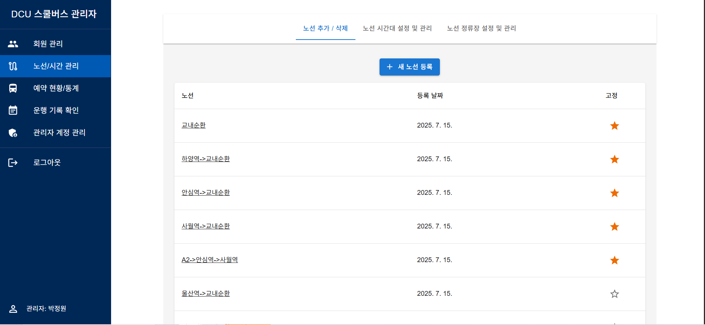
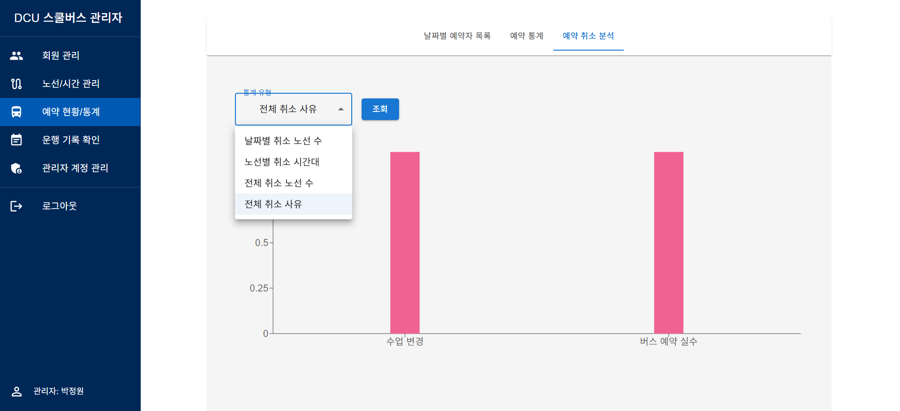

## 프로젝트 개요
스쿨버스 예약 및 운행 관리를 한 곳에서 처리할 수 있는 **웹 관리자 대시보드**입니다.  
관리자는 노선, 정류장, 운행 시간, 기사 스케줄, 공지사항 등을 실시간으로 등록·수정·삭제할 수 있으며,  
예약 현황과 통계를 한눈에 확인할 수 있습니다.

---

## 개발 배경
기존 스쿨버스 운행 관리 방식은 체계가 잡혀있지 않았고, Firebase 내에서만 운행/예약 기록을 확인할 수 있었습니다. 
이에 따라, **실시간 데이터 반영·권한별 관리·시각화**를 통해  
운영 효율성과 데이터 정확성을 높이는 관리 시스템을 개발하게 되었습니다.

---

## 주요 기능
- **노선/정류장/시간 관리**
  - CRUD(생성, 읽기, 수정, 삭제)
  - 모달 기반 수정 및 고정 기능
- **기사 스케줄 관리**
  - 요일·시간·소요시간 선택 후 저장
  - 주간표 시각화(색상 표시, 병합 규칙 적용)
- **회원 관리(학생)**
  - 학생들의 기본 정보 관리(수정, 계정 정지, 메모, 경고, 비밀번호 찾기 기능)
- **공지사항 및 일정 관리**
  - 공지 등록/수정, 별표로 고정 여부 토글
  - 일정 등록/수정, 캘린더에 일정이 존재하면 하늘색으로 표시
  - 등록된 공지사항과 일정은 대시보드(홈)와 연동되어 확인 가능
- **예약 현황/통계**
  - 일별/월별 예약 건수 조회
  - 예약 취소/중복 현황 시각화
- **권한별 접근 제어**
  - 관리자별 기능 접근 여부 설정
- **회원가입 보안 기능**
  - 관리자 계정 생성 시 별도의 관리자 전용 암호 입력 필수
  - 올바른 관리자 암호 입력 시에만 회원가입 가능

---

## 기술 스택
| 구분 | 사용 기술 |
|------|----------|
| **Frontend** | React, Tailwind CSS, JavaScript |
| **Backend** | Firebase Realtime Database, Firebase Authentication |
| **Deployment** | Vercel |
| **Version Control** | Git, GitHub |
| **Tools** | VS Code |

---

## 프로젝트 구조
```
src/
├── components/ 각 페이지 별 폴더 내에 관련 컴포넌트들이 존재
├── pages/ 주요 페이지
├── utils/ 색상 유닛과 권한 제어 관련 유틸
└── context/ 관리자 권한을 위한 컨텍스트
```

---

## 설치 및 실행 방법

- 프로젝트 클론
`git clone https://github.com/username/project.git`

- 패키지 설치
`npm install`

- 개발 서버 실행
`npm run dev`

- 데모 계정
  - 슈퍼관리자: wjddnjs0830, opop8520
  - 기본관리자: SonDongYeol, opop8520 또는 ChoiDongWon, opop8520
 
---

## 주요 페이지별 스크린샷

### 1. 메인화면
- 로그인 시 노출되는 메인화면입니다.
- 다른 페이지에서 좌측 상단의 **DCU 스쿨버스 관리자** 버튼을 누르면 돌아갑니다. 
- 관리자가 등록한 공지사항과 일정을 볼 수 있습니다.
<a href="https://github.com/wonna-0830/home">
  
</a>

---

### 2. 회원관리 탭
- 회원들 중 학생회원을 관리하는 기능입니다.
- 가입한 학생들의 UID, 아이디(이메일), 이름, 가입날짜, 경고 횟수, 정지 여부와 함께 서브 기능으로 회원관리가 가능하도록 했습니다.
<a href="https://github.com/wonna-0830/UserManagement">
  
</a>

---

### 3. 노선/시간 관리
- 스쿨버스의 노선, 시간, 정류장 별로 관리하는 기능입니다.
- 등록, 추가, 삭제, 수정이 가능합니다.

#### 노선 추가
- 노선을 등록하고 사용하는 노선에 고정 표시를 할 수 있습니다.
- 시간 추가와 정류장 추가 기능에는 고정표시된 노선만 노출됩니다.
<a href="https://github.com/wonna-0830/RouteTimeManagement">
  
</a>

#### 시간 추가
- 시간대를 추가하고 시간대 목록을 확인할 수 있습니다.
- 등록된 시간대를 클릭하면 수정이 가능합니다.
<a href="https://github.com/wonna-0830/RouteTimeManagement1">
  
</a>

#### 정류장 추가
- 정류장을 추가하고 정류장 목록을 확인할 수 있습니다.
- 등록된 정류장 클릭하면 수정이 가능합니다.
<a href="https://github.com/wonna-0830/RouteTimeManagement2">
  
</a>

---

### 4. 예약 현황/통계
- 학생들이 예약한 예약 정보를 관리하고 통계로 나타내는 기능입니다.

#### 날짜별 예약자 목록
- 날짜별, 날짜+이름별로 예약 목록을 검색할 수 있습니다.
<a href="https://github.com/wonna-0830/ReservationManagement">
  
  
</a>

#### 예약 통계
- 전체 노선 누적 예약, 날짜별 노선 예약, 노선별 정류장 예약, 노선별 시간대 예약을 통계로 나타냈습니다.
<a href="https://github.com/wonna-0830/ReservationManagement1">
  
</a>

#### 예약 취소 통계
- 전체 취소 노선 수, 날짜별 취소 노선 수, 노선별 취소 시간대, 전체 취소 사유를 통계로 나타냈습니다.
<a href="https://github.com/wonna-0830/ReservationManagement2">
  
</a>

---

### 5. 운행 기록 확인

#### 기사별 운행 이력
- 각 기사들의 운행 이력 확인과, 운행 일정을 추가해 1주일간의 운행 시간표를 볼 수 있습니다.
<a href="https://github.com/wonna-0830/DriverManagement">
  
  
</a>

#### 기사 계정 관리
- 학생 회원 관리와 동일한 컴포넌트로 기사 회원 관리가 가능합니다.
<a href="https://github.com/wonna-0830/DriverManagement1">
  
</a>

---

### 6. 관리자 계정 관리
- 슈퍼관리자가 일반 관리자에게 접근권한을 부여하고, 일정등록과 공지사항을 등록하고 관리하는 기능입니다.

#### 관리자 역할 구분
- 학생 회원관리와 동일한 컴포넌트로 모든 관리자의 관리가 가능합니다.
- 기존 회원관리 컴포넌트에 권한 설정 메뉴를 추가해 권한 설정이 가능합니다.
- 슈퍼관리자인 "박정원" 계정은 권한 설정 메뉴가 없습니다.
<a href="https://github.com/wonna-0830/ManagerManagement">
  
  
</a>

#### 일정 등록 및 관리
- 전체 노선 누적 예약, 날짜별 노선 예약, 노선별 정류장 예약, 노선별 시간대 예약을 통계로 나타냈습니다.
<a href="https://github.com/wonna-0830/ReservationManagement1">
  
</a>

#### 공지사항 등록 및 관리
- 전체 취소 노선 수, 날짜별 취소 노선 수, 노선별 취소 시간대, 전체 취소 사유를 통계로 나타냈습니다.
<a href="https://github.com/wonna-0830/ReservationManagement2">
  
</a>
